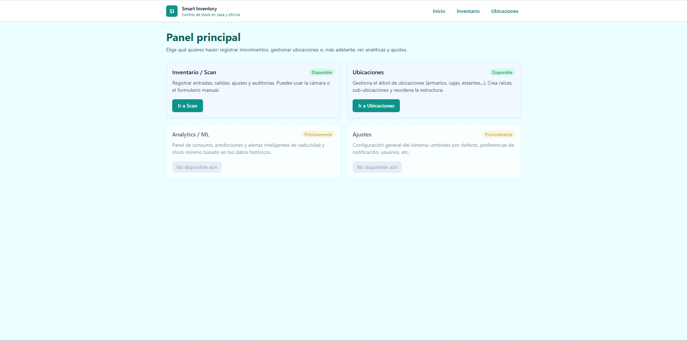
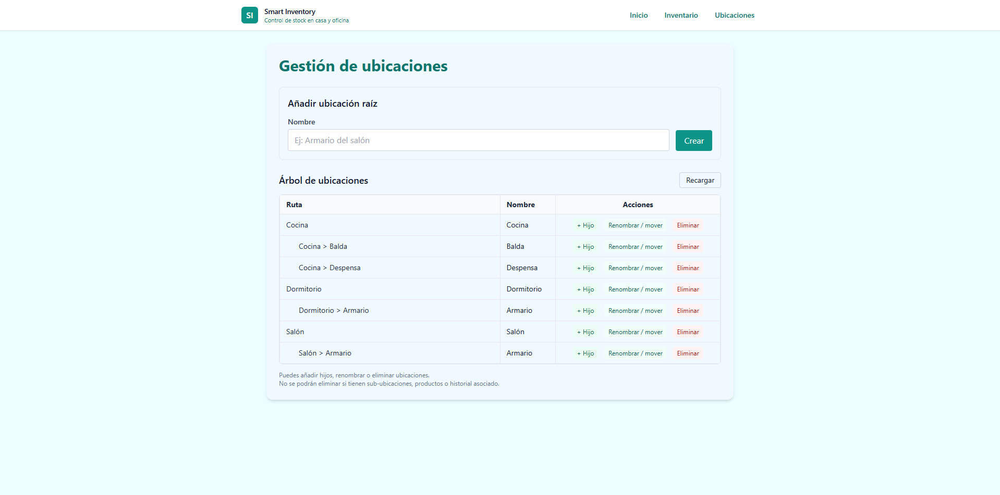

# 🧠 Smart Inventory

Sistema inteligente de gestión de inventario orientado a **uso real**, con soporte para
escaneo QR, auditorías, ubicaciones jerárquicas y distribución como aplicación de escritorio.

**Estado actual:**  
✅ Versión estable **v0.1**  
🔄 Proyecto activo — actualmente en **FASE 5 del roadmap general**

---

## 📌 ¿Qué es Smart Inventory?

Smart Inventory es una aplicación desarrollada con Django pensada para gestionar inventarios
de forma clara y robusta en entornos locales (hogar, taller, pequeño almacén, laboratorio).

Está diseñada para:
- usarse desde navegador en PC,
- acceder desde móvil en red local (PWA),
- distribuirse como ejecutable `.exe` sin dependencias externas.

---

## 🖥️ Vista general de la aplicación

### Home

### Inventario y movimientos (IN / OUT / Auditorías)

### Gestor de ubicaciones jerárquicas

---

## ✅ Estado del proyecto (v0.1)

La versión **v0.1** se considera **estable y usable** para:

- ✔️ Uso local real
- ✔️ Acceso desde móvil en red local (LAN + PWA)
- ✔️ Distribución como ejecutable Windows (.exe)
- ✔️ Persistencia correcta de datos fuera del binario
- ✔️ Auditorías fiables (bug crítico solucionado en backend)

No es una demo ni un prototipo: es una base sólida sobre la que se seguirá construyendo.

---

## 🔧 Funcionalidades principales

- 📦 Gestión de productos y lotes
- 📍 Ubicaciones jerárquicas (árbol)
- 🔄 Movimientos de inventario:
  - `IN` (entrada)
  - `OUT` (salida)
  - `AUD` (auditoría por ubicación)
  - `AUDTOTAL` (auditoría global)
- 📷 Generación y lectura de códigos QR
- 📱 Acceso móvil (PWA en red local)
- 🖥️ Ejecutable Windows con PyInstaller
- 🧾 Logs persistentes
- 💾 Base de datos local estable

---

## 🧭 Roadmap (resumen)

**FASE 1 – Núcleo del inventario**  
✔️ Completada

**FASE 2 – Lógica de negocio**  
✔️ Completada

**FASE 3 – UX / UI**  
🔄 Parcialmente completada (base funcional estable)

**FASE 4 – Login y usuarios**  
⏳ Pendiente (fuera de v0.1)

**FASE 5 – Hardening y seguridad**  
🔄 *FASE ACTUAL*

**FASE 6 – Distribución avanzada**  
⏳ Pendiente

**FASE 7 – Analítica**  
⏳ Pendiente

**FASE 8 – Machine Learning**  
⏳ Pendiente (baja prioridad)

---

## 🧠 Filosofía del proyecto

- Primero estabilidad, luego features
- Bugs reales > features nuevas
- Versiones cerradas y documentadas
- Cada fase deja una base sólida para la siguiente

---

## 📜 Licencia

MIT License.

---

## 👤 Autor

David García  
Proyecto desarrollado como sistema real de inventario y como portfolio técnico.
