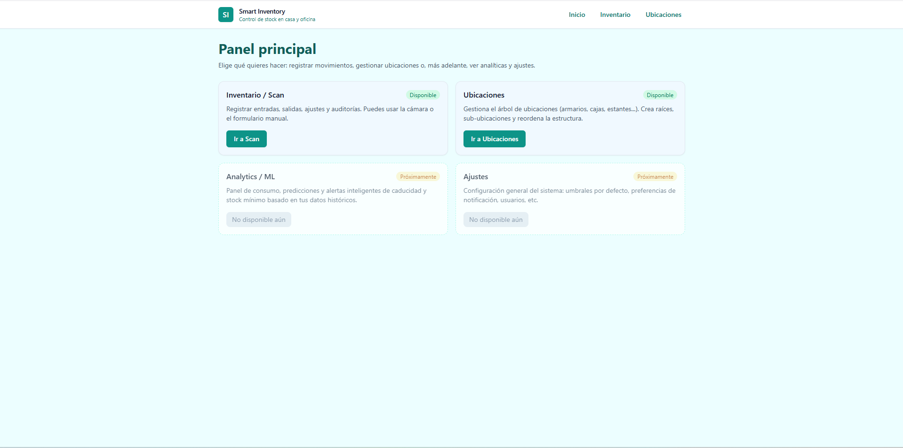
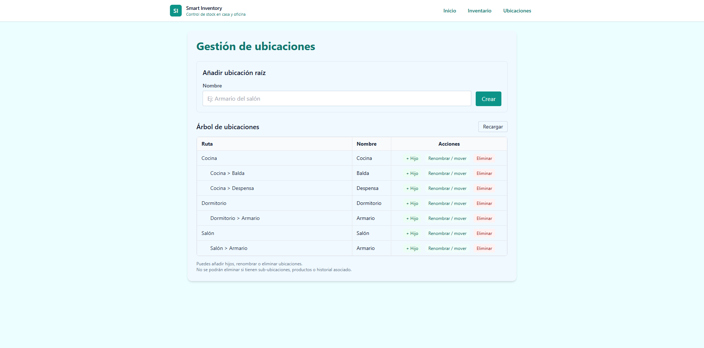

# 🧠 Smart Inventory

📘 **English version:** [README_EN.md](README_EN.md)

Smart Inventory es una aplicación de **gestión de inventario desarrollada en Django**, diseñada para uso real.  
Está pensada para ser **clara, estable y fácil de usar**, tanto en entornos domésticos como en pequeños contextos profesionales.

El objetivo del proyecto es ofrecer una herramienta que no solo registre productos, sino que permita **controlar stock, caducidades y ubicaciones de forma estructurada**, con una base técnica sólida y extensible.

---

## 🖼️ Capturas / GIFs (v0.1)

> Las siguientes imágenes reflejan el estado real de la aplicación en la versión **v0.1**.

- **Pantalla principal:**  
  

- **Gestión de ubicaciones:**  
  

- **Inventario (GIF):**  
  

---

## 🚀 Uso de la aplicación (v0.1)

Smart Inventory v0.1 está diseñada para **uso local en un PC**, con acceso opcional desde un móvil en la misma red.

### 🖥️ Arranque en PC

1. Inicia la aplicación.
2. Accede desde el navegador a `http://localhost:8000`.
3. Inicia sesión o regístrate con un usuario.

### 📱 Acceso desde móvil (misma red)

Desde un móvil conectado a la misma WiFi, accede a:  
`http://IP_DEL_PC:8000`

En Android es posible **añadir un acceso directo a la pantalla de inicio**, permitiendo abrir Smart Inventory como si fuera una app.

---

## 🧭 Modos disponibles

- **Entrada**: registrar nuevos productos o lotes.  
- **Salida (QR + FIFO)**: retirar stock mediante QR o búsqueda manual, siguiendo lógica FIFO.  
- **Auditoría**: comprobar el estado de un producto concreto.  
- **Auditoría total (paginada)**: revisión global del inventario.

---

## ⚙️ Detalles importantes de funcionamiento

- Las auditorías están **paginadas a 25 ítems** por página para asegurar estabilidad y buen rendimiento.
- La aplicación está pensada para **uso local controlado**, sin dependencias externas innecesarias.

---

## ⚠️ Limitaciones reales de la v0.1

- Uso **local únicamente** (sin acceso desde Internet).
- Base de datos **SQLite**.
- Versión orientada a **testing real y validación de estabilidad** antes de ampliar fases.

---

## 🗺️ Roadmap resumido (alto nivel)

- **FASE 1 — Núcleo del inventario**: ✔️ Completada  
- **FASE 2 — Lógica de negocio**: ✔️ Completada  
- **FASE 3 — UX / UI**: 🔄 En progreso (mejoras visuales tras v0.1)  
- **FASE 4 — Login y gestión de usuarios**: ⏳ Planificada (no incluida en v0.1)  
- **FASE 5 — Hardening y seguridad avanzada**: ⏳ Planificada  
- **FASE 6 — Distribución y acceso**: ⏳ Planificada  
- **FASE 7 — Analítica y dashboards**: ⏳ Planificada  
- **FASE 8 — Machine Learning**: ⏳ Exploratoria  

---

**Desarrollado por David García**
